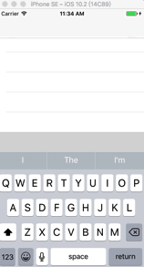

# ESFloatingView

ESFloatingView is a very light plugin for keyboard.

You can just copy folder 'ESFloatingView' to your project

and

```
#import "UIScrollView+ESFloatingView.h"
...
scrollView.ES_floatingView = {subview of scrollView}
...
```

then

When keyboard pop up, this view will float to an appropriate position.

like



